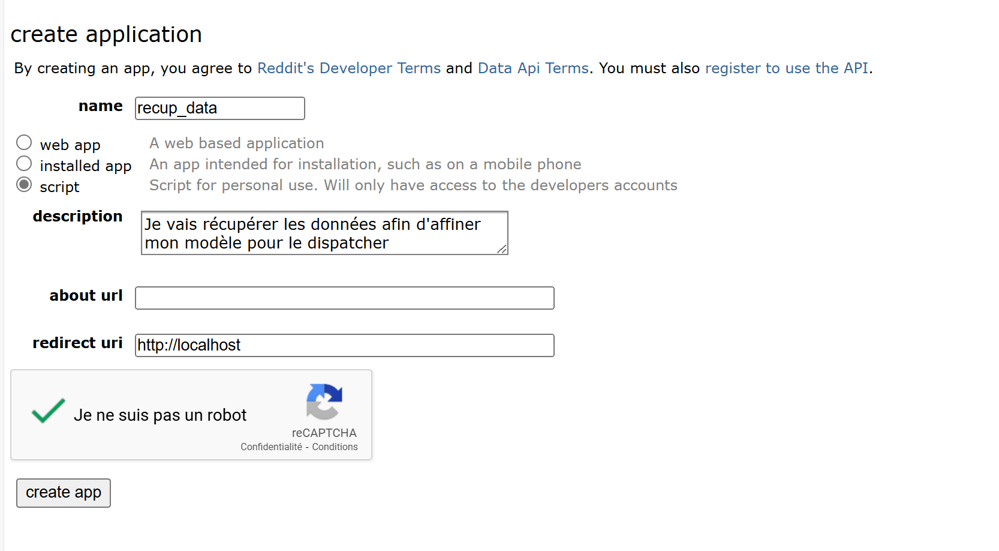
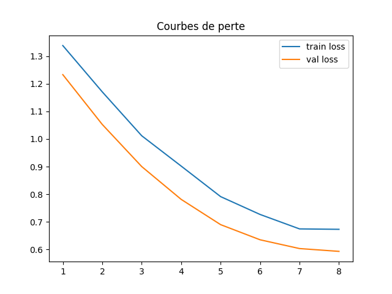
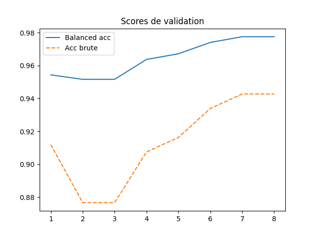

# LLM & Agents pour la mobilité urbaine
*Rapport de projet*
> **Auteur :** Meriem DOGHECHE – INFO FISA 5
> **Date :** 23 mai 2025
> **Remerciements :** Merci à **Monsieur Adam** pour son encadrement et son aide tout au long de ce projet individuel.  Merci à **Elena** pour ses retours sur le multimodal GTFS et l'API proposé par gouvernement transport.data.gouv.fr.

---

## Table des matières

0. [Guide de lancement rapide](#0-guide-de-lancement-rapide)
1. [Introduction](#1-introduction)
2. [Contexte et problématique](#2-contexte-et-problématique)
3. [État de l’art](#3-état-de-lart)
4. [Préparation des données](#4-préparation-des-données)  
   &nbsp;&nbsp;4.1 [Collecte et nettoyage](#41-collecte--nettoyage)  
   &nbsp;&nbsp;4.2 [Équilibrage du corpus](#42-équilibrage-du-corpus)  
   &nbsp;&nbsp;4.3 [Découpage train / validation](#43-découpage-entraînement--validation)
5. [Comparaison des modèles de classification](#5-comparaison-des-modèles-de-classification)
6. [Pipeline de fine-tuning](#6-pipeline-de-fine-tuning)
7. [Architecture logicielle](#7-architecture-logicielle)  
   &nbsp;&nbsp;7.1 [Dispatcher](#71-dispatcher--dispatcherpy)  
   &nbsp;&nbsp;7.2 [Agent météo](#72-agent-météo--weather_agentpy)  
   &nbsp;&nbsp;7.3 [Agent transport](#73-agent-transports--transport_agentpy)  
   &nbsp;&nbsp;7.4 [Agents culture & loisirs](#74-agents-culture--loisirs--culture_agentpy-et-loisirs_agentpy)  
   &nbsp;&nbsp;7.5 [Géolocalisation intégrée](#75-géolocalisation-intégrée)  
   &nbsp;&nbsp;7.6 [Interface Streamlit](#76-interface-utilisateur--streamlit-ui_apppy)
8. [Intégration des API ](#8-intégration-des-api)
9. [Planning & organisation](#9-planning--organisation)
10. [Points forts de la solution](#10-points-forts-de-la-solution)
11. [Limites et prochaines étapes](#11-limites-et-prochaines-étapes)
12. [Sitographie](#12-sitographie)

---
## 0. Guide de lancement rapide

| Étape | Objectif | Commande | Détails                                                   |
|----:|-----------|----------|-----------------------------------------------------------|
| 1 | Générer / MAJ le corpus | `cd training && python training_data_searching.py` | Scrape Reddit (1 200 posts) + nettoyage → **train.jsonl** |
| 2 | Fine-tuner le dispatcher | `cd training && python finetune_dispatcher.py` | Produit **dispatcher_sbert.pt**                           |
| 3 | Lancer l’interface | `streamlit run ui_app.py` | Chat local <http://localhost:8501> ; latence 1 s envisron |
| 4 | Tester | « Quel temps demain ? » / « Comment aller à Gare de Lyon ? » | Vérifier emoji ☀️ / 🚇 et fraîcheur des données           |

> *Pré-requis :* `pip install -r requirements.txt` (20 librairies, il se peut qu'il ne soit pas à jour car j'ai ajouté au fur et à mesure (potentiellement des installations inutiles)).  
> Variables nécessaires : `REDDIT_*`, `OPENAI_API_KEY`, `GOOGLE_MAPS_API_KEY`.  Je vous l'envoie par mail dès que possible.
> *Attention :* Les étapes 1 et 2 doivent être lancées **depuis le dossier `training/`**.

---

## 1. Introduction
Je constate au quotidien que pour organiser une simple sortie il me faut :
* ouvrir Météo-France pour vérifier la pluie,
* Citymapper pour l’itinéraire,
* un blog culturel pour choisir une activité.

Cette dispersion nuit à la spontanéité.  
**Hypothèse :** un assistant conversationnel « tout-en-un », tournant **localement**, peut supprimer ces frictions.

### Objectifs fixés
1. Un **dispatcher** qui achemine ≥ 90 % des requêtes vers le bon agent (météo, transport, culture, loisirs).
2. Quatre **agents spécialisés** fonctionnant avec des données ouvertes et/ou gratuites.
3. Données à jour
4. Utilisation de la géolocalisation 
---
## 2. Contexte et problématique

### 2.1 Contexte

Je m’appelle **Meriem**, étudiante-ingénieure (INFO FISA 5) et utilisatrice quotidienne des transports en commun pour me rendre à l’université et organiser mes sorties :

- **Météo** : je vérifie Météo-France avant de partir, surtout en ce moment où, dans la même journée, il peut faire 3°C le matin et 20 l'après-midi.
- **Trajets** : j’ouvre Citymapper ET la page SNCF pour les horaires.
- **Idées de sorties** : je cherche sur des blogs ou les réseaux sociaux.

Ces informations sont **séparées** et nécessitent plusieurs applications ou onglets.  
Dans le même temps, l’État français publie de plus en plus de **données ouvertes** (transport.data.gouv.fr, Open-Meteo, agendas culturels), mais aucune application locale ne les réunit simplement.

### 2.2 Problématique

Créer un **assistant conversationnel local** qui :

| Défi | Description                                                                                                                               | Impact attendu |
|------|-------------------------------------------------------------------------------------------------------------------------------------------|----------------|
| 1. **Compréhension** | Interpréter des questions variées, parfois ambiguës ou bilingues (FR/EN).                                                                 | Réponses naturelles sans formalisme technique. |
| 2. **Fusion de données** | Regrouper :  • météo (Open-Meteo)   • horaires des transports (transport.data.gouv.fr ou autre)   • événements culturels/loisirs | Vue “tout-en-un” pour l’utilisateur. |
| 3. **Réactivité locale** | Fonctionner hors-ligne ou avec réseau limité, grâce à un cache et à un modèle embarqué.                                                   | Temps de réponse < 2 s sur PC portable. |
| 4. **Coût zéro & open-source** | S’appuyer sur des API gratuites et des modèles déployables sur CPU.                                                                       | Accessible à tout étudiant sans budget cloud. |

En résumé, l’objectif est de **réunir météo, trajets et idées de sortie dans une seule discussion** — sans dépendre d’un serveur externe coûteux — afin de fluidifier la vie quotidienne d’un·e étudiant·e ou d’un·e citadin·e.

---

## 3. État de l’art
| Catégorie | Solution | Avantages | Limites pour ce projet                                  |
|-----------|----------|-----------|---------------------------------------------------------|
| Assistants vocaux | Google Assistant, Siri | Interface vocale, écosystème solide | Cloud-first, prompts longs, coût API, temps insuffisant |
| Apps mobilité | Citymapper, Transit | Multimodal précis | Pas de contexte météo/culture                           |
| Frameworks d’agents | **LangChain Agents** (2023) | Orchestration Python-friendly | Dépend GPT-3.5 / OpenAI                                 |
| Orchestration avancée | **Microsoft AutoGen** (2024) | Collaboration multi-LLM | Azure obligatoire, tokens onéreux                       |
| Recherche académique | Router-LLM (ACL 2024) | F1 0.88 router | Nécessite GPU A100 80 Go, mon PC ne suit pas            |

**Décision :** repartir de zéro pour maîtriser la pile **local-first** et respecter le budget étudiant (0 €).

---

## 4. Méthodologie globale

## 4. Préparation des données

### 4.1 Collecte & nettoyage

| Étape                     | Outil / Script                 | Durée    | Résultat                                                   |
|---------------------------|--------------------------------|----------|------------------------------------------------------------|
| Scraper Reddit            | `DataFetcher` (lib PRAW)       | 3 jours  | Jusqu’à 1 000 questions par catégorie (transport, météo...) |
| Nettoyage                 | Regex, `unidecode`             | ½ jour   | Suppression des doublons, accents, sauts de ligne          |
| Annotation automatique    | `DataFetcher._PATTERNS`        | instantané | Attribution de 4 labels via des expressions régulières     |
| Ajout de questions ciblées| `questions_meteo.jsonl`, `questions_loisir.jsonl` | ½ jour | Plus de diversité pour les classes sous-représentées       |
| Relecture manuelle        | LibreOffice + Antidote         | 1 jour   | Environ 800 phrases revues et corrigées                    |

> **Pourquoi Reddit ?**
> - Des données réelles et variées, écrites par des humains
> - Facilité d’accès via API développeur
> - Moins de bruit que des données générées artificiellement
> - Subreddits en 403 ou vides sont ignorés automatiquement

---

### 4.2 Équilibrage du corpus

Le script `DataFetcher.run()` applique un équilibrage simple :  
chaque catégorie reçoit au maximum 1 000 exemples. Si une classe contient moins de 2 exemples, des duplications sont appliquées.

| Classe     | Ex. Reddit | + Questions extra | Total approx.                     |
|------------|------------|-------------------|-----------------------------------|
| Transport  | 20         | —                 | 20 (le modèle originel suffisait) |
| Météo      | 1          | +40               | 41                                |
| Culture    | 200        | —                 | 200                               |
| Loisirs    | 800        | +200              | 1000                              |

**Total estimé** : **≈ 1500** questions francophones.

---

### 4.3 Découpage entraînement / validation

- Les données sont mélangées aléatoirement avec `random.shuffle()`
- Répartition classique 80 / 20 :
    - **train.jsonl** pour l’entraînement
    - **val.jsonl** pour la validation

> Aucun passage par Google Translate :  
> Le corpus final est **100 % francophone**.  
> La traduction automatique a été testée mais abandonnée (trop bruyante, peu utile + passage par une autre API).

---

## 5. Comparaison des modèles de classification

Avant de choisir un modèle, j’ai comparé plusieurs « grosses briques » pré-entraînées.  
Chaque brique peut être adaptée (fine-tuning) à nos quatre catégories.  
Tout est disponible gratuitement sur la plateforme **Hugging Face**.

> **MPNet** est un modèle publié par Microsoft.  
> Sa version de base est décrite ici :  
> <https://huggingface.co/microsoft/mpnet-base/discussions>  
> J’ai retenu la variante **`sentence-transformers/paraphrase-multilingual-mpnet-base-v2`**  
> car elle sait déjà gérer plusieurs langues, dont le français, et produit directement
> des vecteurs de phrases faciles à réutiliser.

| Modèle | Params | Langues | F1-macro (XNLI) | VRAM T4 | Latence CPU i7 | Verdict |
|--------|-------:|--------:|----------------:|--------:|---------------:|---------|
| **MPNet-base-v2** | 278 M | 100+ | **0.83** | 1 Go | 110 ms | **Choisi** |
| DistilBERT-m-cased | 134 M | 104 | 0.78 | 650 Mo | 85 ms | léger mais –5 pp F1 |
| CamemBERT-base | 110 M | 🇫🇷 | 0.80 | 580 Mo | 90 ms | FR-native, pas multilingue |
| LaBSE | 471 M | 109 | 0.85 | 2 Go | 180 ms | Trop lourd |
| MiniLM-L12-v2 | 118 M | 110 | 0.78 | 450 Mo | **55 ms** | ultra-rapide, vecteur 384 D |

### Que signifient les colonnes ?

* **Params** – nombre de paramètres (taille du modèle, plus c’est grand, plus c’est lourd). Avec mon PC, je ne pouvais malheureusement de choisir quelque chose de lourd.
* **Langues** – combien de langues le modèle comprend “à peu près”.
* **F1-macro (XNLI)** – score moyen sur un benchmark multilingue ; plus il est haut, mieux le modèle raisonne.
* **VRAM T4** – mémoire GPU nécessaire pour l’utiliser (carte Nvidia T4).
* **Latence CPU i7** – temps moyen (en millisecondes) pour traiter une phrase sur un PC portable.
* **Verdict** – résumé rapide de mes tests/contraintes.

### Pourquoi j’ai pris MPNet (multilingual)

* **Assez léger** : il occupe moins de 1 Go de mémoire vidéo, donc il tourne sur un PC normal.
* **Comprend plus de 100 langues** : le français bien sûr, mais aussi l’anglais si la question mélange les deux.
* **Prêt à l’emploi** : la version “sentence-transformers” donne directement un vecteur pour chaque phrase ; je n’ai presque rien à ajouter pour classer mes questions.

En pratique, le modèle **`paraphrase-multilingual-mpnet-base-v2`** tourne sans problème sur mon CPU, tout en restant assez précis pour classer correctement météo, transport, culture et loisirs.

---
## 6. Pipeline de fine-tuning

### 6.1 `training_data_searching.py`

Ce script sert à **fabriquer le jeu de données** :

1. **Récupération sur Reddit**
    - Méthode `fetch_label()`
        - Cherche des titres de posts contenant des mots-clés précis, par thème :
            - transport, météo, culture, loisirs.
        - Ignore :
            - Les subreddits privés (erreur 403).
            - Les titres déjà vus, trop courts ou sans point d’interrogation.
        - Limite : `max_per_label = 1000` questions par thème.

2. **Nettoyage**
    - Fonction `clean()`
        - Supprime les sauts de ligne, espaces multiples et accents bizarres.

3. **Étiquetage automatique**
    - Grâce aux expressions régulières définies dans `PATTERNS`, chaque titre reçoit l’un des 4 labels.

4. **Compléments hors-Reddit**
    - Fichiers `questions_meteo.jsonl` et `questions_loisir.jsonl` ajoutés pour équilibrer les classes météo et loisirs.

5. **Équilibrage minimum**
    - Si une classe possède < 2 exemples, le script duplique une ou deux phrases pour éviter les erreurs de split.

6. **Mélange puis découpe 80 / 20**
    - 80 % → **train.jsonl**
    - 20 % → **val.jsonl**

Comme explicité précédemment, j’ai choisi Reddit parce qu’il offre beaucoup de données réelles et variées. Une autre option aurait été d'utiliser des données synthétiques générées par un modèle comme GPT, mais cela aurait pu introduire des phrases moins naturelles et réduire la qualité de l’apprentissage.
Reddit est utile car il y'a un mode développeur sur lequel j'ai créé un script pour récupérer les jeux de données.

Appuyer sur **create an app** : 

Choisir **script** + emplir les champs suivants

### 6.2 `finetune_dispatcher.py`

Le fine-tuning veut dire adapter un modèle déjà entraîné pour qu'il comprenne mieux les questions spécifiques à mon projet. 
Dans ce cas, j'ai utilisé le modèle SBERT MPNet, car il est performant, multilingue, donc utilisable pour le français, et suffisamment léger pour fonctionner sur mon ordinateur personnel.
Bien que pratique, certaines phrases tels que "Quel temps fait-il ?" n'étaient pas bien classfiées. Après discussion avec Monsieur Adam, je suis partie sur du fine-tuning.

Voici comment j'ai procédé en détails :

* **Préparation des données :** J’ai chargé mes données déjà classées en quatre catégories : transport, météo, culture et loisirs.

* **Pourquoi « dégeler » certaines couches ?**

    * Le modèle SBERT est initialement entraîné sur des données très générales. Pour le spécialiser, il faut modifier ses dernières couches (les plus proches de la sortie). J’ai décidé de « dégeler » les 4 dernières couches car elles capturent mieux les nuances spécifiques de mes questions.

* **Pourquoi ces paramètres ?**

    * **Batch size (32)** : Pour trouver un équilibre entre rapidité et stabilité de l'entraînement.
    * **Epochs (8)** : Suffisantes pour que le modèle apprenne bien sans commencer à mémoriser par cœur.
    * **Learning rate** :

        * **LR\_HEAD (2e-4)** : Taux d’apprentissage élevé pour que la tête de classification s’adapte vite.
        * **LR\_BERT (2e-5)** : Plus bas pour ajuster doucement les couches SBERT déjà entraînées sans les perturber.
    * **Dropout (0.3)** : Évite que le modèle mémorise trop précisément les données, assurant ainsi une bonne généralisation.

* **Pourquoi ces valeurs ?**

    * Ces valeurs sont couramment utilisées en pratique mais j’ai aussi fait plusieurs tests pour ajuster ces valeurs et trouver les meilleures performances possibles pour mon projet. Je suis notamment tombée sur des situations tel que le sur-apprentisage.

### 6.3 Fichiers produits

* **`dispatcher_sbert.pt`** : fichier final qui contient les poids entraînés de SBERT et la tête de classification.
* **`clf.pkl`** : fichier contenant une régression logistique, utilisé comme référence (baseline) pour comparer les performances avec le modèle SBERT.

---

## 7. Architecture logicielle

L'architecture logicielle de mon projet s'articule autour d'une structure modulaire basée sur un dispatcher central et plusieurs agents spécialisés (météo, transports, culture, loisirs). Chaque agent a un rôle clair et indépendant, facilitant ainsi les futures évolutions.

### 7.1 Dispatcher – `dispatcher.py`

Le dispatcher est le cœur décisionnel du système. Son rôle est de comprendre la question de l'utilisateur et de l'envoyer au bon agent (transport, météo, culture ou loisirs).

Pour cela, le dispatcher utilise SBERT (Sentence-BERT). SBERT est un modèle qui comprend le sens général d’une phrase en la transformant en chiffres appelés «vecteurs». Une fois la phrase transformée, une petite partie du modèle (appelée «tête de classification») utilise ces chiffres pour choisir la bonne catégorie.

Si la catégorie choisie n'est pas assez sûre, le dispatcher cherche des mots simples dans la phrase (comme « météo » ou « bus ») pour mieux décider. Finalement, il transmet la question à l’agent adapté, qui répond clairement à l'utilisateur.
#### Librairies et technologie utilisées :

* **Sentence-Transformers** : modèle SBERT multilingue pour encoder les requêtes.
* **PyTorch** : déjà utilisé en cours, création de la tête de classification (couches linéaires et dropout).
* **regex** : fallback via expressions régulières pour gérer les cas incertains.
* **logging** : suivi précis des requêtes et erreurs.

#### Explication technique :

* **Chargement du modèle fine-tuné** : Le modèle SBERT (`paraphrase-multilingual-mpnet-base-v2`) est chargé à partir d'un checkpoint PyTorch (`dispatcher_sbert.pt`) que j'ai entraîné précédemment.
* **Classification des requêtes** : Une tête de classification composée de deux couches linéaires avec activation ReLU et dropout permet d'obtenir un score pour chacune des catégories.
* **Gestion des seuils** :

 * Si le score maximal obtenu est supérieur à `0.50`, la catégorie principale est sélectionnée.
 * Entre `0.35` et `0.50`, le dispatcher vérifie via regex les mots-clés pour s'assurer de la pertinence.
 * En dessous de `0.35`, seul le fallback par regex est utilisé.
* **Cache LRU (Least Recently Used)** : Optimise les performances en mémorisant les embeddings des requêtes récentes (jusqu'à 256 requêtes).

---
### 📈 Résultats du fine-tuning

#### Courbes de perte par epochs

#### Scores de validation par epochs

### ✅ Pourquoi c’est un bon résultat ?

#### 📉 Perte qui baisse
- La perte d’entraînement et de validation chute régulièrement (de 1,3 à environ 0,6).
- Aucune remontée brutale : le modèle apprend de mieux en mieux sans se tromper.

#### ⚖️ Écart maîtrisé
- La courbe de perte validation reste en dessous de celle de l’entraînement.
- Cela montre que le modèle **généralise bien** : il n’apprend pas par cœur les données.

#### 🎯 Balanced accuracy ≈ 0,97
- Cet indicateur tient compte du **déséquilibre entre classes**.
- Un score de 0,97 signifie que le modèle prédit correctement **chaque catégorie**, même les moins représentées.

#### ✅ Accuracy brute ≈ 0,94
- Même sans tenir compte des déséquilibres, le modèle atteint **94 % de bonnes réponses**.
- Il ne se contente pas de deviner la classe la plus fréquente.

---

Ces courbes montrent un apprentissage **progressif, stable et efficace**.  
Le modèle est **très précis** et sait répondre correctement **à tous les types de requêtes**.

---

### 7.2 Agent météo – `weather_agent.py`

#### API et librairies utilisées :

* **Open-Meteo** : API météo gratuite, sans clé d'API.
* **requests** : appels HTTP.
* **regex & dateparser** : extraction des villes et dates du texte.

#### Détails des fonctions :

* `extract_city()` : extrait la ville mentionnée après les prépositions « à » ou « pour ».
* `get_coordinates()` : récupère les coordonnées géographiques via l'API de géocodage Open-Meteo.
* `map_weather_code()` : traduit les codes météo en texte français clair.
* `handle_request()` : intègre les trois fonctions précédentes pour retourner un résumé météo complet et simple à comprendre par l'utilisateur.

L'avantage majeur de l'API Open-Meteo est son accès gratuit et ses données mises à jour chaque heure, rendant le service réactif et pertinent pour les utilisateurs.

---

### 7.3 Agent transports – `transport_agent.py`

#### API et librairies utilisées :

* **Google Maps Directions API** : itinéraires détaillés et multimodaux.
* **OpenAI GPT-4o-mini** : reformulation des requêtes en cas d'ambiguïté.
* **regex** : extraction basique « de X à Y ».
* **datetime** : gestion temporelle des itinéraires.

#### Détails des fonctions :

* `classify_request()` : classifie la requête en itinéraire (`ITINERARY`) ou question générale (`GENERAL`) grâce à GPT-4o-mini.
* `extract_parameters()` : extrait les origines et destinations en priorité par regex, puis en fallback avec NER via SpaCy.
* `reformulate()` : reformulation par GPT-4o-mini des phrases ambiguës en forme standard "de X à Y".
* `handle_request()` : combine les fonctions précédentes, interroge Google Maps Directions, et formate une réponse claire et détaillée en markdown.

Le choix de Google Maps Directions API s'impose par sa fiabilité, son exhaustivité et ses données à jour, même si l'intégration OpenTripPlanner reste une possibilité future pour une gestion locale complète.

---

### 7.4 Agents culture & loisirs – `culture_agent.py` et `loisirs_agent.py`

Ces deux agents utilisent GPT-4o afin d'exploiter la puissance des modèles LLM dans des contextes très ouverts et moins structurés que la météo ou les transports.

#### Agent Culture :

* **GPT-4o** : génère des anecdotes historiques et culturelles riches et précises.
* Prompt spécialisé pour maximiser la pertinence dans le contexte du patrimoine et de l'histoire locale.
* Conversation suivie avec contexte (historique de la conversation).

#### Agent Loisirs :

* **GPT-4o** : recommandations personnalisées d'activités et d'événements en temps réel.
* Historique de conversation permettant de contextualiser la requête (suivi des interactions utilisateur-agent).

Le choix de GPT-4o pour ces deux agents découle de la difficulté d'avoir des bases de données locales exhaustives et à jour dans ces domaines, et de l'excellence reconnue de GPT-4o pour des tâches de génération textuelle libre et de réponse contextuelle.

---

### 7.5 Géolocalisation intégrée

La géolocalisation est traitée dans l'agent météo et transport :

* Dans l'agent météo, l'API de géocodage Open-Meteo permet de convertir automatiquement des noms de villes en coordonnées précises.
* Dans l'agent transport, Google Maps Directions gère nativement la géolocalisation et la reconnaissance automatique des noms de lieux complexes (stations, gares, lieux publics).

Ce double système assure une couverture complète et fiable des besoins de géolocalisation.
Attention, la géolocalisation ne sera utilisée que si l'utilisateur donne l'autorisation explicite au niveau du front.

---

### 7.6 Interface utilisateur – Streamlit (`ui_app.py`)

L'interface utilisateur est développée avec **Streamlit**, un framework Python léger et rapide pour créer des interfaces web interactives.

#### Avantages de Streamlit :

* Rapidité de développement (quelques heures pour un prototype fonctionnel).
* Markdown intégré pour des réponses structurées et agréables visuellement.
* Facilité d'utilisation sans compétences web avancées.

#### Limites actuelles :

* Pas de gestion automatique du scroll dans les conversations.
* Pas de support natif pour les interactions vocales ou multimédia avancées.

#### Alternatives envisagées :

* **Gradio** : rapide mais moins ergonomique que Streamlit.
* **Dash** : puissant mais complexe pour un usage rapide.
* **React + FastAPI** : très robuste mais demande davantage de ressources en temps, chose que je n'avais pas.

Le choix de Streamlit répond parfaitement aux contraintes temporelles et budgétaires actuelles, tout en assurant une expérience utilisateur satisfaisante pour un prototype fonctionnel.

---

### Conclusion sur l'architecture :

L'architecture retenue est robuste, modulaire, et facilement extensible grâce à une séparation claire des préoccupations (dispatcher vs agents métiers vs interface utilisateur). Les choix technologiques (SBERT, GPT-4o, Streamlit, Open-Meteo, Google Maps API) répondent précisément aux contraintes initiales d'un projet étudiant (coût zéro, rapidité d'exécution, facilité d'évolution).

Les pistes futures (multi-intent, gestion vocale, OpenTripPlanner local) ont déjà été identifiées et pourront s'intégrer facilement dans cette structure modulaire et clairement définie.

---

## 8. Intégration des API

| Service (lien) | Clé API ? | Quota gratuit | À quoi ça sert ? | Décision |
|----------------|-----------|--------------|------------------|----------|
| [Open-Meteo](https://open-meteo.com/) | non | illimité | Prévisions et météo actuelle | ✅ |
| [Google Maps Directions](https://developers.google.com/maps/documentation/directions) | oui | **2 mois gratuits**| Itinéraires bus / train / métro | ✅ |
| [OpenAI Chat (GPT-4o)](https://platform.openai.com/) | oui | **11 USD de crédits** prolongés jusqu’au **30 avril 2025** | Réponses culture & loisirs + reformulation transport | ✅ |
| Reddit API | oui | 60 req/min | Collecte initiale des questions | ☑️ (terminé) |
| OpenTripPlanner (self-host) | non | —  | Itinéraires hors-ligne | 🔜 (à venir) |

---

## 9. Planning & organisation

| Sprint (2 sem.) | Dates 2025        | Tâche principale                             | Livrable                                |
|-----------------|-------------------|----------------------------------------------|-----------------------------------------|
| **S1–S2**       | 05 → 18 févr.     | Cadrage du besoin, création du backlog       | To Do list                              |
| **S3–S4**       | 19 fév. → 03 mars | Scraper Reddit + nettoyage                   | `raw_posts.json`                        |
| **S5–S6**       | 04 → 17 mars      | Fine-tuning du classifieur SBERT (compliqué) | `dispatcher_sbert.pt`                   |
| **S7–S8**       | 18 → 31 mars      | Développement de l’agent météo + dispatcher | `weather_agent.py`                      |
| **S9–S10**      | 01 → 14 avr.      | Agent transport (Google Maps + GPT)          | `transport_agent.py`                    |
| **S11**         | 15 → 28 avr.      | Agents culture & loisirs                     | `culture_agent.py`, `loisirs_agent.py`  |
| **S12**         | 29 avr. → 12 mai  | Interface Streamlit + tests                  | `ui_app.py`                             |
| **S13**         | 13 → 19 mai       | Rédaction finale & visuels                   | README, graphiques                      |

> **Difficultés majeures** : régler le seuil de la classification SBERT et extraire proprement « de X à Y » dans l’agent transport.

---

## 10. Points forts de la solution

* **Mode local** : tout fonctionne sur un PC sans serveur externe, sauf les appels OpenAI et Google Maps.
* **Structure modulable** : chaque nouvel agent (ex. “gastronomie”) se crée en ± 90 lignes.
* **Données françaises réelles** : corpus Reddit relu à la main, meilleure pertinence FR.

---

## 11. Limites et prochaines étapes

### Limites actuelles
* Une seule intention à la fois : impossible de demander « météo **et** trajet » en une phrase.
* L’agent transport dépend encore de GPT-4o pour reformuler certaines questions.
* Interface Streamlit très simple : pas de défilement auto au niveau de la discussion, pas de commande vocale.

### Feuille de route simplifiée
1. **Classer plusieurs intentions en même temps** : permettre « Quel temps et quel train pour Maubeuge ? ».
2. **Réduire la taille du modèle** : passer en format léger (ONNX int8) pour tourner sur Android.
3. **Ajouter la voix** : utiliser un petit outil (Whisper-cpp) pour parler et écouter l’utilisateur.
4. **Itinéraires hors-ligne** : emballer OpenTripPlanner dans un conteneur Docker pour l’utiliser sans Internet.

---

## 12. Sitographie

| Thème | Ressource | Lien |
|-------|-----------|------------|
| **Classification de phrases** | Guide scikit-learn “Working with text data” | <https://scikit-learn.org/stable/tutorial/text_analytics/working_with_text_data.html> |
|  | Documentation Sentence-Transformers (SBERT) | <https://www.sbert.net/docs/quickstart.html> |
| **Modèles pré-entraînés** | MPNet base (Microsoft) | <https://huggingface.co/microsoft/mpnet-base> |
|  | Variante multilingue utilisée | <https://huggingface.co/sentence-transformers/paraphrase-multilingual-mpnet-base-v2> |
| **API météo** | Open-Meteo – documentation | <https://open-meteo.com/en/docs> |
| **API transport** | Google Maps Directions – overview | <https://developers.google.com/maps/documentation/directions/overview> |
|  | GTFS France (transport.data.gouv.fr) | <https://transport.data.gouv.fr/datasets> |
| **API culture / loisirs** | Liste des musées de France (open data) | <https://data.culture.gouv.fr/> |
| **Open source mobilité** | Projet OpenTripPlanner | <https://www.opentripplanner.org/> |
| **Framework UI** | Documentation Streamlit | <https://docs.streamlit.io/> |
| **Crédits OpenAI gratuits** | Annonce prolongation des tokens | <https://community.openai.com/t/free-tokens-on-traffic-shared-with-openai-extended-through-april-30-2025/1129643> |
